<h1 align = "center">2021互联网计算实验报告</h1>


<h3 style="line-height:1.0" align = "center">第 18 组</h1>
<h4 style="line-height:0.6" align = "center">组长：关昕宇&nbsp&nbsp&nbsp&nbsp&nbsp&nbsp&nbsp&nbsp&nbsp学号：191840077</h1>
<h4 style="line-height:0.6" align = "center">组员：冯亚林&nbsp&nbsp&nbsp&nbsp&nbsp&nbsp&nbsp&nbsp&nbsp学号：191850036</h1>
<h4 style="line-height:0.6" align = "center">组员：张林杰&nbsp&nbsp&nbsp&nbsp&nbsp&nbsp&nbsp&nbsp&nbsp学号：191250193</h1>
<h4 style="line-height:0.6" align = "center">组员：夏宇&nbsp&nbsp&nbsp&nbsp&nbsp&nbsp&nbsp&nbsp&nbsp学号：191850205</h1>
<h4 style="line-height:0.6" align = "center">组员：王涛&nbsp&nbsp&nbsp&nbsp&nbsp&nbsp&nbsp&nbsp&nbsp学号：191850189</h1>


### 目录

[toc]

### 实验要求

0. 自行设计拓扑，现场实现之，完成后提交报告予现场助教或老师确认。  
1. 拓扑需使用动态路由协议。   
2. 拓扑中需包含VLAN及trunk技术。   
3. 拓扑至少需包含设备：2台交换机、4台路由器、4台PC。  
4. 每组时间为60分钟。   
5. 上机报告需包含拓扑说明、相关路由表信息、连通性说明。提交时现场助教或老师将在现场确认。 
6. 每组结束后需要清除设备配置保证设备正常交由助教确认后方可离开。

### 使用技术
  - RIP 路由协议
  - VLAN 路由连接
  - Trunk 技术
  - ACL 防火墙设置
  - NAT 技术
  - PPP
### 实验目标
  1. 掌握在路由器上启动 RIP 路由进程
  2. 掌握查看和调试 RIP 路由协议相关信息
  3. 深入了解交换机 VLAN 的配置
  4. 熟悉不同 VLAN 之间路由的配置
  5. 熟悉 Trunk 的配置
  6. 掌握静态 NAT 的配置和基本调试
  7. 掌握 ACL 的配置
  8. 掌握 PPP 的配置
### 实验内容
1. 配置 RIP

2. 配置 VLAN

3. 配置 Trunk

4. 配置 NAT

5. 配置 ACL

6. 配置PPP

### 实验拓扑

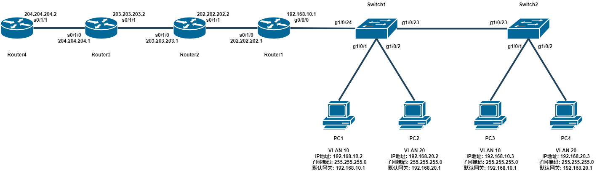


#### Step 1 配置PC

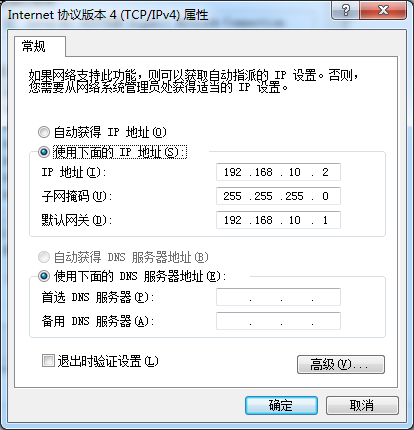

<h6 style="line-height:1.0" align = "center">图1：PC1的配置</h1>

PC 1:

IP 地址: 192.168.10.2

子网掩码: 255.255.255.0

默认网关: 192.168.10.1


PC 2:

IP 地址: 192.168.20.2

子网掩码: 255.255.255.0

默认网关: 192.168.20.1


PC 3:

IP 地址: 192.168.10.3

子网掩码: 255.255.255.0

默认网关: 192.168.10.1


PC 4:

IP 地址: 192.168.20.3

子网掩码: 255.255.255.0

默认网关: 192.168.20.1


#### Step 2 配置路由器

###### Router1

```bash
Router>enable 
Router#config terminal 
Router#hostname Router1
Router1(config)#int s0/1/0 
Router1(config-if)#ip address 202.202.202.1 255.255.255.0 
Router1(config-if)#no shut
Router1(config-if)#exit
```

###### Router2

```bash
Router>enable 
Router#config terminal 
Router#hostname Router2
Router2(config)#int s0/1/0 
Router2(config-if)#ip address 203.203.203.1 255.255.255.0
Router2(config-if)#no shut 
Router2(config-if)#exit
Router2(config)#int s0/1/1 
Router2(config-if)#ip address 202.202.202.2 255.255.255.0
Router2(config-if)#no shut 
Router2(config-if)#exit
```
###### Router3

```bash
Router>enable 
Router#config terminal 
Router#hostname Router3
Router3(config)#int s0/1/0 
Router3(config-if)#ip address 204.204.204.1 255.255.255.0
Router3(config-if)#no shut 
Router3(config-if)#exit
Router3(config)#int s0/1/1 
Router3(config-if)#ip address 203.203.203.2 255.255.255.0
Router3(config-if)#no shut
Router3(config-if)#exit
```
###### Router4

```bash
Router>enable 
Router#config terminal 
Router#hostname Router4
Router4(config)#int s0/1/1
Router4(config-if)#ip address 204.204.204.2 255.255.255.0 
Router4(config-if)#no shut
Router4(config-if)#exit
```


#### Step 3 RIP

###### Router1

```bash
Router1(config)#router rip  
Router1(config-router)#network 202.202.202.0 
Router1(config-router)#end
```

###### Router2

```bash
Router2(config)#router rip 
Router2(config-router)#network 202.202.202.0 
Router2(config-router)#network 203.203.203.0 
Router2(config-router)#end
```
###### Router3

```bash
Router3(config)#router rip 
Router3(config-router)#network 203.203.203.0 
Router3(config-router)#network 204.204.204.0 
Router3(config-router)#end
```
###### Router4

```bash
Router4(config)#router rip 
Router4(config-router)#network 204.204.204.0 
Router4(config-router)#end
```

###### 验证RIP

用 Router1 ping Router4，能够 ping 通，RIP配置完成

```bash
Router1#ping 204.204.204.2
```

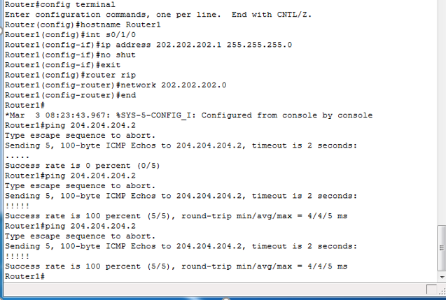

<h6 style="line-height:1.0" align = "center">图2：Router1成功ping通Router4</h1>


查看Router1路由表

```bash
Router1#show ip route
```

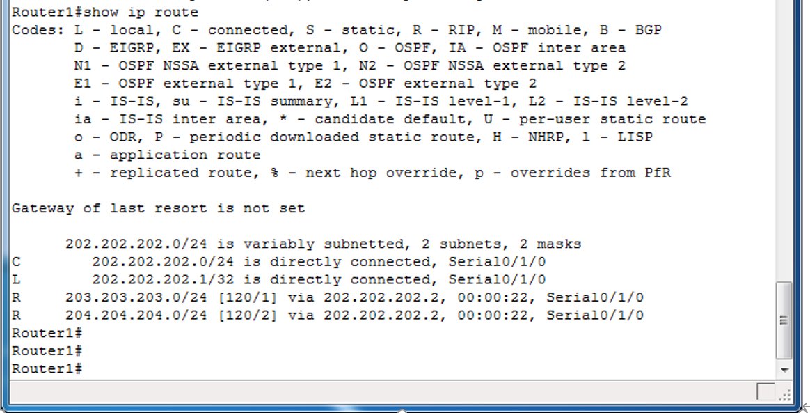

<h6 style="line-height:1.0" align = "center">图3：RIP配置完成后的Router1路由表</h1>


#### Step 4 VLAN划分与Trunk配置

###### Switch1 

```bash
Switch>enable
Switch#config terminal
Switch(config)#hostname Switch1
Switch1(config)#int g1/0/23
Switch1(config-if)#switchport mode trunk 
Switch1(config-if)#exit
Switch1(config)#int g1/0/24
Switch1(config-if)#switchport mode trunk 
Switch1(config-if)#exit

Switch1(config)#vlan 10
Switch1(config-vlan)#exit
```

###### Switch2

```bash
Switch>enable
Switch#config terminal
Switch(config)#hostname Switch2
Switch2(config)#int g1/0/23
Switch2(config-if)#switchport mode trunk 
Switch2(config-if)#exit

Switch2(config)#vlan 20
Switch2(config-vlan)#exit
```

###### Switch1

```bash
Switch1(config)#int g1/0/1 
Switch1(config-if)#switchport mode access 
Switch1(config-if)#switchport access vlan 10 
Switch1(config-if)#exit
Switch1(config)#int g1/0/2 
Switch1(config-if)#switchport mode access 
Switch1(config-if)#switchport access vlan 20
```

###### Switch2

```bash
Switch2(config)#int g1/0/1 
Switch2(config-if)#switchport mode access 
Switch2(config-if)#switchport access vlan 10
Switch2(config-if)#exit
Switch2(config)#int g1/0/2 
Switch2(config-if)#switchport mode access 
Switch2(config-if)#switchport access vlan 20
```

###### Router1

```bash
Router1#config terminal 
Router1(config)#int g0/0/0 
Router1(config-if)#no ip address 
Router1(config-if)#no shut
Router1(config-if)#exit
Router1(config)#int g0/0/0.10 
Router1(config-subif)#encapsulation dot1q 10 
Router1(config-subif)#ip address 192.168.10.1 255.255.255.0
Router1(config-subif)#no shut 
Router1(config-subif)#exit
Router1(config)#int g0/0/0.20 
Router1(config-subif)#encapsulation dot1q 20 
Router1(config-subif)#ip address 192.168.20.1 255.255.255.0
Router1(config-subif)#no shut
```

###### 验证VLAN

用PC1 ping PC2、3、4 ，都能ping通：说明vlan配置成功

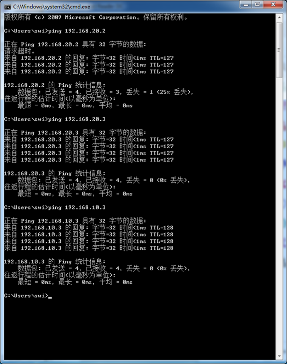

<h6 style="line-height:1.0" align = "center">图4：PC1成功ping通PC2、3、4</h1>

```bash
Switch1#show vlan brief
Switch2#show vlan brief
```

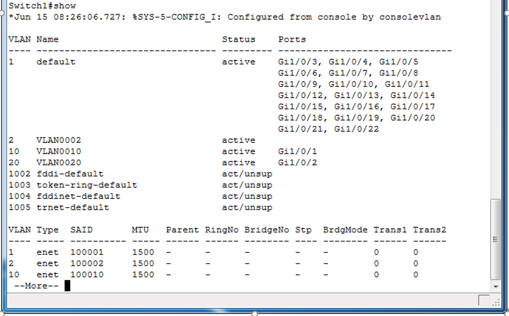

<h6 style="line-height:1.0" align = "center">图5：Switch1的vlan配置</h1>

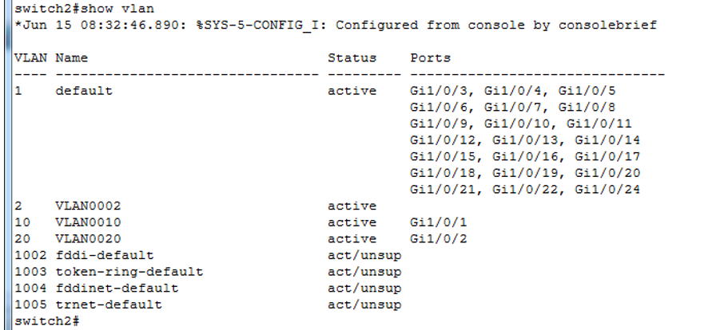

<h6 style="line-height:1.0" align = "center">图6：Switch2的vlan配置</h1>

#### Step 5 NAT

###### Router1

```bash
Router1(config)#ip nat inside source static 192.168.10.2 202.202.202.4 
Router1(config)#ip nat inside source static 192.168.10.3 202.202.202.5  
Router1(config)#ip nat inside source static 192.168.20.2 202.202.202.6 
Router1(config)#ip nat inside source static 192.168.20.3 202.202.202.7 
Router1(config)#int g0/0/0 
Router1(config-if)#ip nat inside
Router1(config-if)#exit
Router1(config)#int s0/1/0 
Router1(config-if)#ip nat outside
```

###### 验证NAT

```bash
Routerl#show ip nat translations
```

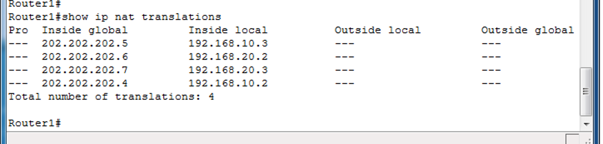

<h6 style="line-height:1.0" align = "center">图7：Router1的NAT转换表</h1>


从Router4(outside) ping 202.202.202.4

```bash
Router4#ping 202.202.202.4
```

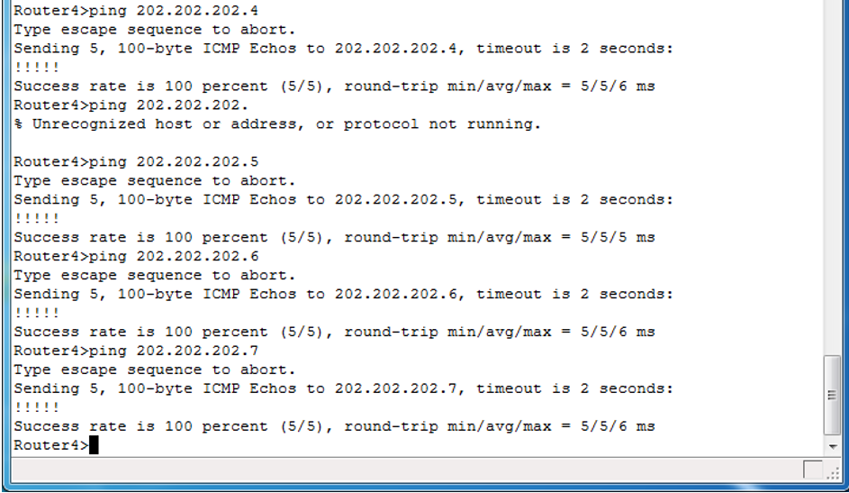

<h6 style="line-height:1.0" align = "center">图8：Router4成功ping通202.202.202.4</h1>


#### Step 6 配置ACL

###### Router2

```bash
Router2#config terminal 
Router2(config)#access-list 100 deny icmp host 204.204.204.2 host 202.202.202.4
Router2(config)#access-list 100 permit icmp any any 
Router2(config)#int s0/1/0
Router2(config-if)#ip access-group 100 in
```

###### 验证ACL

```bash
Router2#show access-list
```

==截图==

<h6 style="line-height:1.0" align = "center">图9：Router2的ACL配置</h1>


再用Router4 ping PC1 ，发现已经ping不通了，刚才能通说明NAT正确，现在不通说明ACL正确

```bash
Router4#ping 202.202.202.4
```

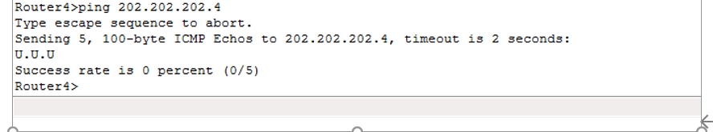

<h6 style="line-height:1.0" align = "center">图10：Router4无法ping通202.202.202.4</h1>


#### Step 7 配置PPP

###### Router 3 (server)

```bash
Router3(config)#username nju password ccna
Router3(config)#int s0/1/0
Router3(config-if)#encapsulation ppp
Router3(config-if)#ppp authentication pap
Router3(config-if)#no shut
Router3(config-if)#exit
```

###### Router 4 (client)

```bash
Router4(config)#interface serial0/1/1
Router4(config-if)#encapsulation ppp
Router4(config-if)#no shut
```

###### 验证

首先ping一下，已经ping不通了

```bash
Router4#ping 204.204.204.1
```

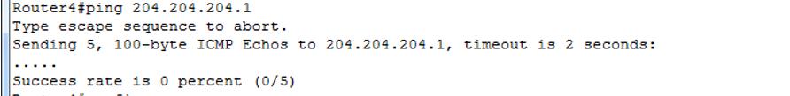

<h6 style="line-height:1.0" align = "center">图11：未设置账号密码时，Router4无法ping通204.204.204.1</h1>


在client端(Router4)使用错误账号密码，ping不通

```bash
Router4#config terminal
Router4(config)#interface s0/1/1
Router4(config-if)#ppp pap sent-username abcd password abcd
Router4(config-if)#end
Router4#ping 204.204.204.1
```

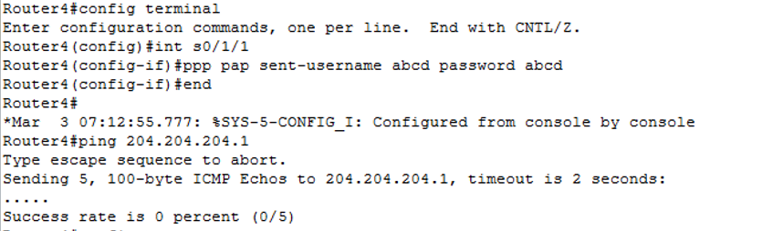

<h6 style="line-height:1.0" align = "center">图12：设置错误账号密码时，Router4无法ping通204.204.204.1</h1>


在client端(Router4)使用正确账号密码，能ping通

```bash
Router4#config terminal
Router4(config)#interface s0/1/1
Router4(config-if)#ppp pap sent-username nju password ccna
Router4(config-if)#end
Router4#ping 204.204.204.1
```

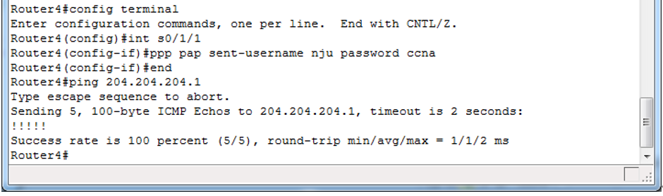

<h6 style="line-height:1.0" align = "center">图13：设置正确账号密码时，Router4可以ping通204.204.204.1</h1>


#### 总结

```
通过RIP联通网段202.202.202.0/24，203.203.203.0/24，204.204.204.0/24

通过VLAN和Trunk技术，使192.168.10.0网段和192.168.20.0网段通信

通过NAT技术，将192.168.10.0网段和192.168.20.0网段静态映射到202.202.202.0网段上地址与其他网段实现通信

通过在Router3设置ACL,实现阻止202.202.202.4(PC1)到204.204.204.2的转发

通过在Router3和Router4间设置PAP，完成了PAP验证
```

